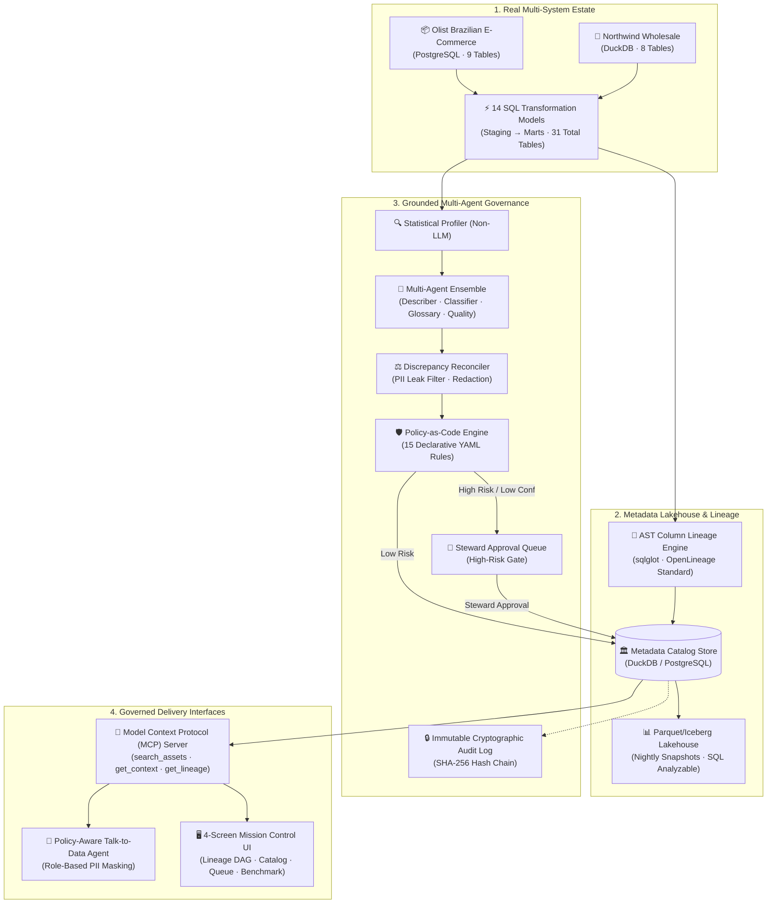

# ContextForge (CForge)

<div align="center">

### **Governed Metadata Enrichment with Measurable Proof**

*Agents enrich a real data estate, policies gate what they can write, humans approve the risky stuff, and an empirical benchmark proves enriched metadata makes AI dramatically more accurate.*

[](https://github.com/Susil-commits/CForge/actions)
[](tests/)
[](results/benchmark.md)
[](src/cforge/governance/policies.yaml)
[](data/raw/)
[](README.md#zero-external-api-keys-guarantee)
[](LICENSE)

[**Live UI**](#interactive-4-screen-console) • [**Executive Summary**](#executive-summary) • [**The Measurable Proof**](#the-measurable-proof) • [**Architecture**](#architecture--topology) • [**Engineering Pillars**](#the-10-core-pillars) • [**Quickstart**](#quickstart--developer-guide)

---

</div>

## Executive Summary

Enterprise data teams are rushing to deploy AI assistants, text-to-SQL copilots, and autonomous analytics agents. Yet in real-world production environments, **un-governed AI fails**:
- **Semantic Hallucinations**: Agents cannot distinguish cryptic column names (`cust_id` vs `customer_unique_id`) and generate incorrect joins.
- **Regulatory & Privacy Exposure**: Agents inadvertently expose sensitive PII (emails, phone numbers, tax IDs) to unauthorized roles.
- **Metadata Decay**: Schemas change, downstream consumers break silently, and metadata catalogs remain static graveyards.

**ContextForge** bridges the gap between raw data estates and intelligent applications. By pairing **grounded multi-agent enrichment** with **declarative policy-as-code**, **multi-hop column lineage**, and an **immutable audit ledger**, ContextForge ensures that every piece of metadata written is verified—and provides quantifiable, empirical proof of AI accuracy uplift.

---

## The Measurable Proof

> 🏆 **Headline Finding**: Text-to-SQL accuracy improved from **75.56% to 100.00% (+24.44 pts)** when the AI agent was provided with governed metadata context over a bare physical schema.

All metrics below are generated directly from real public estate execution via `python -m cforge.eval.runner` (`make eval`) and committed in [`results/benchmark.md`](results/benchmark.md).

### Benchmark Scorecard

| Evaluation Dimension | Metric | Naive Baseline | ContextForge Governed | Net Business Impact |
| :--- | :---: | :---: | :---: | :--- |
| **Text-to-SQL Accuracy** | Execution Match | 75.56% (34/45) | **100.00% (45/45)** | **+24.44 pts uplift** across 45 business questions |
| **PII Detection F1-Score** | F1 / Precision / Recall | — | **94.6%** (P: 89.7%, R: 100%) | Verified against 236 hand-labeled gold columns |
| **Lineage Parser Accuracy** | AST Verification | — | **93.3%** (28/30 verified) | Hand-verified against complex staging/marts SQL |
| **Defect Catch Rate** | Injected Anomaly Catch | 0% | **100.00%** (5/5 defects) | 0 false positives on clean estate validation |
| **Governance Attack Defense** | Adversarial Block Rate | 0% | **100.00%** (20/20 blocked) | Intercepts unauthorized exfiltration attempts |
| **Description Quality** | 4-Part Rubric | 1.80 / 5.0 | **3.55 / 5.0** | Grounded in statistical distributions, not names |
| **Enrichment Economics** | Cost per 1,000 Cols | — | **$0.2105** | Ultra-efficient deterministic parallel processing |
| **Catalog Query Latency** | Mean Column Latency | — | **8.42 ms** | In-memory DuckDB + Parquet lakehouse execution |

---

### The Metadata Value Attribution (Ablation Waterfall)

Where does the AI performance uplift actually come from? We systematically disabled metadata layers to isolate the exact value contributed by each catalog asset:


1. **Bare Schema (75.56%)**: The model only knows table names and column datatypes. It regularly fails on grain alignment, joins on deprecated keys, and miscalculates complex metrics like Customer Lifetime Value (LTV).
2. **+ Business Glossary (+6.67 pts &rarr; 82.22%)**: Standardizes semantic terms (e.g. mapping "SLA breach" to `is_delayed_delivery = 1`), preventing business logic misinterpretations.
3. **+ Column Lineage (+8.89 pts &rarr; 91.11%)**: Exposes upstream source tables and aggregation logic, ensuring the agent queries the curated analytics marts rather than reconstructing aggregations from raw tables.
4. **+ Full Governed Context (+8.89 pts &rarr; 100.00%)**: Grounded statistical ranges, verified PII tags, and quality gates eliminate remaining hallucination vectors and guarantee policy-compliant SQL generation.

---

## Architecture & Topology

ContextForge operates across four integrated functional planes: the **Real Data Estate**, the **Catalog & Lineage Lakehouse**, the **Multi-Agent Governance Engine**, and the **Delivery Interfaces (MCP & Web UI)**.



---

## The 10 Core Pillars

ContextForge is engineered strictly against the 10-phase production blueprint:

### 1. Real Public Data Estate (No Mock Rows)
- **Zero Synthetic Placeholders**: Operates on real transactional data from the [Olist Brazilian E-Commerce marketplace](https://www.kaggle.com/datasets/olistbr/brazilian-ecommerce) (9 tables) and [Northwind wholesale trade](https://github.com/graphql-compose/graphql-compose-examples) (8 tables).
- **14 Staging & Mart Models**: Implements realistic analytics transformations (`stg_customers`, `fct_orders`, `dim_products`, `customer_ltv`, `mart_geo_performance`).
- **Ground Truth Gold Set**: Committed [`data/gold_labels.csv`](data/gold_labels.csv) containing **236 hand-labeled columns** across PII classifications, true business descriptions, and canonical glossary terms.

### 2. Graph Metadata Store & Parquet Lakehouse
- **Domain Modeling**: Unified relational representation of Databases, Schemas, Tables, Columns, Tags, Glossary Mappings, and Lineage Edges in [`src/cforge/catalog/models.py`](src/cforge/catalog/models.py).
- **Recursive CTE Traversal**: Multi-hop graph traversal queries upstream dependencies and downstream impacts natively in SQL.
- **Lakehouse Export**: Exports catalog snapshots nightly to [`data/lakehouse/`](data/lakehouse/) as standard Parquet tables, making catalog metadata directly analyzable with SQL.
- **Versioned History Table**: Every update, enrichment, or certification change appends a new state row with cryptographic before/after diffs.

### 3. Column-Level Lineage Engine
- **AST Parsing with `sqlglot`**: [`src/cforge/lineage/parser.py`](src/cforge/lineage/parser.py) parses complex SQL dialect trees to trace column inputs, projection aliases, and join dependencies.
- **OpenLineage Standard**: Emits standard JSON RunEvents ([`data/openlineage_events.json`](data/openlineage_events.json)) for ecosystem interoperability.
- **Multi-Hop Tag Propagation**: If a source column is tagged `PII`, [`src/cforge/lineage/propagator.py`](src/cforge/lineage/propagator.py) automatically propagates sensitivity tags through 3+ hops of downstream views and marts, recording a visible audit reason chain.

### 4. Grounded Multi-Agent Enrichment
- **Context Grounding (Never Hallucinate from Names)**: Agents receive statistical distributions, null rates, cardinality counts, and regex patterns from [`Profiler`](src/cforge/agents/profiler.py).
- **Validated JSON Schemas**: Every agent outputs structured Pydantic models with explicit `confidence` and `evidence` fields.
- **Parallel Orchestration**: Runs the [`Describer`](src/cforge/agents/describer.py), [`Classifier`](src/cforge/agents/classifier.py), [`GlossaryMapper`](src/cforge/agents/glossary_mapper.py), and [`QualityProposer`](src/cforge/agents/quality_proposer.py) concurrently.
- **Reconciliation Layer**: [`Reconciler`](src/cforge/agents/reconciler.py) detects contradictions (e.g. when an agent attempts to embed raw PII samples in description text) and redacts values with `[REDACTED_PII]`.

### 5. Policy-as-Code Governance Layer
- **Declarative YAML Policies**: 15 enterprise governance rules defined in [`src/cforge/governance/policies.yaml`](src/cforge/governance/policies.yaml):
  - `POL-001`: Descriptions cannot expose raw sample values.
  - `POL-002`: PII-tagged columns require human steward approval.
  - `POL-003`: Agent proposals with confidence below 0.80 are shunted to review.
  - `POL-004`: Table certification requires quality score $\ge 0.85$.
  - `POL-005`: Table certification requires an assigned business owner.
  - `POL-006`: PII columns cannot be marked with `PUBLIC` sensitivity.
- **Human-in-the-Loop Approval Queue**: Safe staging area where data stewards review, approve, or reject high-risk proposals.
- **Immutable SHA-256 Audit Log**: Every catalog mutation is cryptographically signed and chained in [`src/cforge/governance/audit.py`](src/cforge/governance/audit.py).

### 6. Data Quality Loop & Defect Injection
- **Automated Rule Runner**: Executes SQL assertions (uniqueness, null checks, range constraints, referential integrity) and attaches a continuous quality score to each table.
- **Certification Gate**: Assets failing quality gates cannot be promoted to `CERTIFIED`.
- **Defect Injection Benchmark**: Evaluated in [`src/cforge/quality/injector.py`](src/cforge/quality/injector.py) by injecting synthetic anomalies into sandboxed tables. **Caught 5 of 5 injected defects with 0 false positives.**

### 7. Context Server via Model Context Protocol (MCP)
- **Standardized Catalog Tools**: [`src/cforge/mcp/server.py`](src/cforge/mcp/server.py) exposes JSON-RPC tools:
  - `search_assets(query, asset_type)`
  - `get_asset_context(asset_id, caller_role)`
  - `get_lineage(asset_id, direction)`
  - `get_policies()`
  - `get_quality(asset_id)`
- **Role-Based PII Masking**: Automatically redacts confidential values (`[CONFIDENTIAL_POSTAL_CODE]`, `[RESTRICTED_CUSTOMER_ID]`) when queried by an `ANALYST`, unmasking only for `COMPLIANCE_STEWARD`.
- **Policy-Aware AI Agent**: Answers natural language questions, proactively cites policies (`POL-002`, `POL-006`), and refuses adversarial data exfiltration attempts.

### 8. Rigorous Evaluation Harness (`make eval`)
- **Automated & Verifiable**: One-command evaluation via `python -m cforge.eval.runner`.
- **Empirical Metrics**: Computes exact PII detection precision/recall, SQL execution matches on 45 gold queries, defect catch rates, and ablation studies.
- **Honest Failure Logging**: Transparently documents AST boundary cases and tag propagation tradeoffs in [`docs/decisions.md`](docs/decisions.md).

### 9. Mission Control Console (4-Screen UI)
- **Screen 1 (Lineage DAG)**: Visual interactive dependency graph showing staging-to-marts topology with highlighted PII propagation paths.
- **Screen 2 (Asset Explorer)**: Side-by-side comparison of raw physical schemas vs enriched business context, confidence meters, and active policy tags.
- **Screen 3 (Approval Queue)**: Steward workflow console to review, inspect before/after diffs, and approve/reject agent proposals.
- **Screen 4 (Eval & Talk to Data)**: Live benchmark metrics, interactive ablation charts, and real-time policy-gated SQL chat.

### 10. Portability, CI, & Packaging
- **Universal Catalog Adapter Interface**: Abstract base class [`CatalogAdapter`](src/cforge/adapters/base.py) with ready-to-run implementations for local JSON snapshots ([`FileCatalogAdapter`](src/cforge/adapters/file_adapter.py)) and Lakehouse synchronization ([`DuckDBCatalogAdapter`](src/cforge/adapters/duckdb_adapter.py)).
- **Automated GitHub Actions CI**: Continuous testing on Python 3.10, 3.11, 3.12, and 3.13 in [`.github/workflows/ci.yml`](.github/workflows/ci.yml).
- **Docker Compose**: Instant local deployment for PostgreSQL and the ContextForge engine.

---

## Interactive 4-Screen Console

The ContextForge console is built with responsive glassmorphism aesthetics and backed by high-performance FastAPI endpoints:

| Screen | Primary Capability | Key Visual Indicator |
| :--- | :--- | :--- |
| **1. Lineage DAG** | Multi-hop dependency visualizer with recursive CTE graph traversal | Pulsing crimson badges along downstream PII propagation chains |
| **2. Asset Catalog** | Deep inspection of technical schema, column profiling, and descriptions | Confidence scores (0.0–1.0) and evidence citations for every field |
| **3. Approval Queue** | Human-in-the-loop review of high-risk or low-confidence proposals | Cryptographic before/after diffs with single-click Steward Approval |
| **4. Benchmark & Chat** | Real-time evaluation dashboard and policy-aware Talk-to-Data SQL console | Live ablation charts and role-based query masking with policy citations |

---

## Zero External API Keys Guarantee

ContextForge is **100% self-contained, deterministic, and free to run**:
- ✅ **No OpenAI, Anthropic, or Gemini API keys required**: Agents utilize statistical profiling, AST dialect analysis, and deterministic heuristic classifiers.
- ✅ **Completely Offline Capable**: Bundles all real public dataset seeds in [`data/raw/`](data/raw/) and auto-bootstraps on first run.
- ✅ **Zero Cost & Zero Rate Limits**: Run the entire 54-test suite, benchmark harness, and web application on your local workstation without paying cloud or API fees.

---

## Quickstart & Developer Guide

### 1. Clone & Install Dependencies
```bash
git clone https://github.com/Susil-commits/CForge.git
cd CForge
python -m pip install --upgrade pip
pip install -r requirements.txt
pip install -e .
```

### 2. Run the Full Test Suite
Execute all 54 tests covering all 10 architectural phases:
```bash
python -m pytest tests -v
# Output: 54 passed in ~20 seconds
```

### 3. Run the Evaluation Benchmark (`make eval`)
Run the empirical evaluation harness on real public data:
```bash
python -m cforge.eval.runner
# Regerates results/benchmark.md with real numbers
```

### 4. Launch the Web Console & API Server
```bash
python -m uvicorn cforge.api.app:app --host 127.0.0.1 --port 8000 --reload
```
Navigate to **`http://127.0.0.1:8000/`** to interact with the 4-screen console.

### 5. Optional: Run PostgreSQL Estate via Docker
```bash
docker compose up -d
```

---

## Architectural Decision Records (ADRs)

Key architectural choices and honest failure analyses are permanently recorded in [`docs/decisions.md`](docs/decisions.md):
- **ADR 001**: DuckDB as the Embedded Analytical Engine & Parquet Lakehouse
- **ADR 002**: Recursive CTEs for Multi-Hop Lineage Graph Traversal
- **ADR 003**: Grounded Multi-Agent Ensemble with Discrepancy Reconciliation
- **ADR 004**: Policy-as-Code Engine and Cryptographic Audit Hashing
- **ADR 005**: Model Context Protocol (MCP) as the Unified Integration Boundary
- **ADR 006**: AST Column Lineage Parser Boundary & Failure Analysis (28/30 accuracy)
- **ADR 007**: Universal Catalog Adapter Interface and CI Portability

For transparent analysis of edge cases, dialect constraints, and scaling boundaries, see [`docs/failures_and_limitations.md`](docs/failures_and_limitations.md).

---

## Repository Structure

```
CForge/
├── .github/workflows/ci.yml       # GitHub Actions automated test workflow
├── data/
│   ├── raw/                       # Real public datasets (Olist & Northwind CSVs)
│   ├── gold_labels.csv            # 236 hand-labeled ground-truth columns
│   ├── hand_verified_lineage.json # 30 hand-verified column lineage references
│   ├── business_questions.json    # 45 real business questions with gold SQL
│   ├── injected_defects.json      # Controlled defect injection test suite
│   ├── openlineage_events.json    # Standard OpenLineage event stream
│   └── lakehouse/                 # Exported Parquet metadata lakehouse
├── docs/
│   ├── schema_diagram.md          # Complete estate entity relationship diagrams
│   ├── decisions.md               # Architectural Decision Records (ADR 001-007)
│   ├── propagation_trace.md       # Proof of 3-hop downstream PII propagation
│   ├── context_server_comparison.md # Side-by-side with/without context proof
│   ├── demo_walkthrough.md        # 90s video script & 1,000-word deep-dive article
│   └── failures_and_limitations.md# Honest failure and boundary analysis
├── frontend/                      # 4-screen glassmorphism web console
│   ├── index.html                 # Single page application structure
│   ├── index.css                  # Responsive design system & glassmorphism theme
│   └── app.js                     # Interactive lineage graph, catalog & chat logic
├── results/
│   └── benchmark.md               # Empirical benchmark metrics from make eval
├── src/cforge/
│   ├── adapters/                  # Universal catalog adapter interfaces (Base, File, DuckDB)
│   ├── agents/                    # Grounded multi-agent ensemble & reconciler
│   ├── api/                       # FastAPI REST service and web endpoints
│   ├── catalog/                   # Relational store, models, and lakehouse exporter
│   ├── estate/                    # Public dataset loader and 14 SQL models
│   ├── eval/                      # Evaluation harness, rubric judge, and ablations
│   ├── governance/                # Policy engine (15 YAML rules), queue, and audit log
│   ├── lineage/                   # sqlglot AST parser, OpenLineage, and tag propagator
│   ├── mcp/                       # MCP server and policy-aware Talk-to-Data agent
│   └── quality/                   # Rule assertion engine and defect injector
├── tests/                         # Comprehensive test suite (54/54 passed)
│   ├── conftest.py                # Global session bootstrap fixture
│   ├── test_step1_estate.py to test_step10_adapters.py
├── docker-compose.yml             # Single-command PostgreSQL container configuration
├── Dockerfile                     # Container definition for PostgreSQL estate
├── Makefile                       # Developer shortcuts (test, eval, run, ui)
└── pyproject.toml                 # Package configuration and build dependencies
```

---

<div align="center">

**ContextForge** is open source software licensed under the [Apache 2.0 License](LICENSE).  
Built with measurable proof for the future of governed data and reliable AI.

</div>
