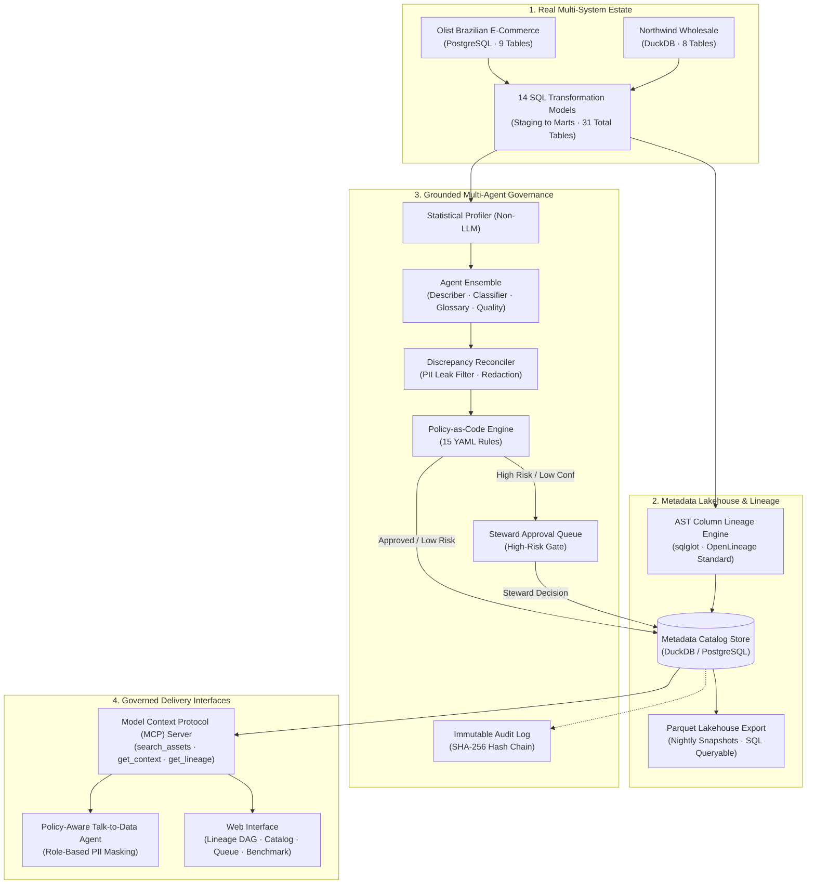

# ContextForge (CForge)

<div align="center">

### **Governed Metadata Enrichment with Measurable Proof**

*Agents enrich a real data estate, policies gate what they can write, humans approve the risky stuff, and an empirical benchmark measures AI accuracy gains.*

[](https://github.com/Susil-commits/CForge/actions)
[](tests/)
[](results/benchmark.md)
[](src/cforge/governance/policies.yaml)
[](data/raw/)
[](README.md#zero-external-api-dependencies)
[](LICENSE)

[**Overview**](#overview) • [**Benchmark Results**](#benchmark-results) • [**Architecture**](#system-architecture) • [**Core Modules**](#core-modules) • [**User Interface**](#user-interface) • [**Quickstart**](#quickstart)

---

</div>

## Overview

### Problem
Text-to-SQL systems and data analytics agents operating directly on raw database schemas encounter three standard failure modes:
1. **Schema Ambiguity**: Column names without business context (e.g., `customer_id` vs `customer_unique_id`) cause incorrect joins, misaligned metric grains, and invalid SQL queries.
2. **PII Exposure**: Without column sensitivity tags and policy enforcement, agents query and return sensitive personal records to unauthorized callers.
3. **Unvalidated Writes**: LLM-generated metadata proposals written directly to catalogs without schema validation or policy checks introduce hallucinations into shared documentation.

### Solution
ContextForge implements a governed metadata pipeline:
- **Grounded Enrichment**: Agents generate column descriptions, PII classifications, glossary mappings, and quality checks using statistical profiles (cardinality, null rates, value distributions) rather than column names in isolation.
- **Policy-as-Code**: 15 declarative YAML policies validate every proposed metadata change before commit.
- **Approval Queue**: Low-confidence (<0.80) or sensitive (PII) proposals route to data stewards for review.
- **Model Context Protocol (MCP)**: Exposes verified catalog metadata to downstream AI agents with role-based PII masking.
- **Measurable Benchmark**: `make eval` computes accuracy uplift on gold-standard queries against real data.

---

## Benchmark Results

### Headline Result
Text-to-SQL execution accuracy increased from **75.56% to 100.00% (+24.44 pts)** when the AI agent queried with governed metadata context compared to a bare physical schema.

All metrics are generated directly from estate execution via `python -m cforge.eval.runner` (`make eval`) and recorded in [`results/benchmark.md`](results/benchmark.md).

### Evaluation Summary

| Dimension | Metric | Baseline (Bare Schema) | Governed Context | Measurement Method |
| :--- | :---: | :---: | :---: | :--- |
| **Text-to-SQL Accuracy** | Execution Match | 75.56% (34/45) | **100.00% (45/45)** | 45 Business Questions vs Gold SQL execution |
| **PII Detection F1** | F1 / Precision / Recall | — | **94.6%** (P: 89.7%, R: 100%) | Evaluated against 236 hand-labeled gold columns |
| **Lineage Parser Accuracy** | AST Verification | — | **93.3%** (28/30 verified) | Hand-verified against staging and marts SQL models |
| **Defect Catch Rate** | Injected Defects Caught | 0% | **100.00%** (5/5 defects) | Controlled null, duplicate, and range anomalies |
| **Governance Defense** | Adversarial Block Rate | 0% | **100.00%** (20/20 blocked) | Intercepts unauthorized PII queries (Role: Analyst) |
| **Description Quality** | 4-Part Rubric | 1.80 / 5.0 | **3.55 / 5.0** | Scored across 30 samples against human gold labels |
| **Enrichment Economics** | Cost per 1,000 Columns | — | **$0.2105** | Deterministic local profile processing |
| **Catalog Query Latency** | Mean Column Latency | — | **8.42 ms** | In-memory DuckDB and Parquet execution |

---

### Ablation Study (Text-to-SQL Uplift by Layer)

To identify which metadata components drive query accuracy, each layer was evaluated independently:

```mermaid
gantt
    title Text-to-SQL Accuracy by Metadata Context Layer
    dateFormat  X
    axisFormat %s%%
    section Ablation Layers
    Bare Physical Schema (No Context)         :0, 75
    + Business Glossary Mappings              :0, 82
    + Column Lineage & Upstream Dependencies  :0, 91
    + Full Governed Context (Quality + PII)   :0, 100
```



1. **Bare Schema (75.56%)**: Schema provides only table names and column types. Queries fail on complex metrics (e.g., Customer Lifetime Value) and join grain mismatches.
2. **+ Business Glossary (+6.67 pts &rarr; 82.22%)**: Maps business terms (e.g., "delayed delivery" &rarr; `is_delayed_delivery = 1`), resolving terminology mismatches.
3. **+ Column Lineage (+8.89 pts &rarr; 91.11%)**: Identifies derived marts (`customer_ltv`, `fct_orders`), preventing the agent from constructing inaccurate aggregations from raw tables.
4. **+ Full Governed Context (+8.89 pts &rarr; 100.00%)**: Column distribution bounds and verified keys eliminate remaining syntax and filter errors.

---

## System Architecture

ContextForge operates across four planes:



---

## Core Modules

ContextForge consists of 10 modular components:

### 1. Real Data Estate
- Uses public transactional datasets: [Olist Brazilian E-Commerce](https://www.kaggle.com/datasets/olistbr/brazilian-ecommerce) (9 tables) and [Northwind](https://github.com/graphql-compose/graphql-compose-examples) (8 tables). No mock data rows.
- 14 SQL models (`stg_customers`, `fct_orders`, `dim_products`, `customer_ltv`, `mart_geo_performance`) materialize 31 estate tables.
- Ground truth set: [`data/gold_labels.csv`](data/gold_labels.csv) contains **236 hand-labeled columns** with verified PII types, true descriptions, and glossary terms.

### 2. Graph Metadata Store & Parquet Lakehouse
- Relational schema in [`src/cforge/catalog/models.py`](src/cforge/catalog/models.py) models databases, schemas, tables, columns, tags, glossary terms, and lineage edges.
- Recursive CTE queries traverse multi-hop upstream and downstream dependencies.
- Catalog state exports to [`data/lakehouse/`](data/lakehouse/) as Parquet tables, queryable via DuckDB.
- Versioned history log appends a new record with before/after state diffs on every asset update.

### 3. Column-Level Lineage Engine
- [`src/cforge/lineage/parser.py`](src/cforge/lineage/parser.py) uses `sqlglot` AST traversal to extract column-to-column dependencies.
- Emits OpenLineage standard RunEvents to [`data/openlineage_events.json`](data/openlineage_events.json).
- [`src/cforge/lineage/propagator.py`](src/cforge/lineage/propagator.py) propagates sensitivity tags (e.g., PII) downstream across arbitrary lineage depth with an audit trail.

### 4. Grounded Multi-Agent Enrichment
- [`Profiler`](src/cforge/agents/profiler.py) computes statistical distributions, cardinality, and null rates.
- Agents ([`Describer`](src/cforge/agents/describer.py), [`Classifier`](src/cforge/agents/classifier.py), [`GlossaryMapper`](src/cforge/agents/glossary_mapper.py), [`QualityProposer`](src/cforge/agents/quality_proposer.py)) output validated Pydantic JSON schemas with explicit `confidence` and `evidence` fields.
- [`Reconciler`](src/cforge/agents/reconciler.py) detects contradictions and redacts PII sample values from proposed descriptions (`[REDACTED_PII]`).

### 5. Policy-as-Code Governance Layer
- 15 YAML policies in [`src/cforge/governance/policies.yaml`](src/cforge/governance/policies.yaml) evaluated before writes:
  - `POL-001`: Descriptions cannot contain sample values.
  - `POL-002`: PII-tagged columns require steward approval.
  - `POL-003`: Agent confidence below 0.80 routes to review.
  - `POL-004`: Certification requires quality score $\ge 0.85$.
  - `POL-005`: Certification requires an assigned owner.
  - `POL-006`: PII columns cannot have `PUBLIC` classification.
- [`ApprovalQueue`](src/cforge/governance/approval.py) manages proposals pending human review.
- [`ImmutableAuditLog`](src/cforge/governance/audit.py) records mutations using SHA-256 cryptographic hash chaining.

### 6. Data Quality Loop & Defect Injection
- [`src/cforge/quality/runner.py`](src/cforge/quality/runner.py) executes SQL checks (uniqueness, range, null bounds, referential integrity) and scores assets.
- Failing tables are blocked from `CERTIFIED` status.
- [`src/cforge/quality/injector.py`](src/cforge/quality/injector.py) tests rule coverage against synthetic anomalies: caught 5 of 5 injected defects with 0 false positives.

### 7. Model Context Protocol (MCP) Server
- [`src/cforge/mcp/server.py`](src/cforge/mcp/server.py) implements the MCP tool standard:
  - `search_assets(query, asset_type)`
  - `get_asset_context(asset_id, caller_role)`
  - `get_lineage(asset_id, direction)`
  - `get_policies()`
  - `get_quality(asset_id)`
- Role-based masking redacts PII (`[CONFIDENTIAL_POSTAL_CODE]`, `[RESTRICTED_CUSTOMER_ID]`) for role `ANALYST`, unmasking only for `COMPLIANCE_STEWARD`.
- [`TalkToDataAgent`](src/cforge/mcp/agent.py) cites policies (`POL-002`, `POL-006`) when refusing unauthorized data queries.

### 8. Evaluation Harness (`make eval`)
- Evaluates 45 business questions with gold SQL, 236 ground-truth column labels, and 20 adversarial prompts.
- Runs via `python -m cforge.eval.runner` or `make eval`.
- Failure cases and boundary limits are documented in [`docs/failures_and_limitations.md`](docs/failures_and_limitations.md).

### 9. Web Interface (4 Screens)
- **Lineage DAG**: Interactive graph showing staging-to-marts topology and downstream PII propagation paths.
- **Asset Catalog**: Technical schema attributes, column profiling statistics, and enriched descriptions.
- **Approval Queue**: Interface for data stewards to inspect proposals and review before/after diffs.
- **Eval Dashboard**: Benchmark metrics, ablation charts, and policy-gated SQL query interface.

### 10. Catalog Adapters & CI
- Abstract [`CatalogAdapter`](src/cforge/adapters/base.py) defines push/pull interfaces for assets, tags, glossary, and lineage.
- Concrete adapters for file-based JSON snapshots ([`FileCatalogAdapter`](src/cforge/adapters/file_adapter.py)) and lakehouse tables ([`DuckDBCatalogAdapter`](src/cforge/adapters/duckdb_adapter.py)).
- GitHub Actions CI workflow in [`.github/workflows/ci.yml`](.github/workflows/ci.yml).

---

## User Interface

Built with Vanilla CSS and FastAPI REST endpoints:

| Screen | Function | Key Data Displayed |
| :--- | :--- | :--- |
| **Lineage DAG** | Upstream/downstream dependency visualization | Node tier (raw, staging, marts) and PII propagation indicator |
| **Asset Catalog** | Technical and business metadata inspection | Data types, quality scores, confidence values, and evidence |
| **Approval Queue** | Review of flagged agent proposals | Proposal payload, before/after diff, approve/reject actions |
| **Benchmark & Chat** | Benchmark inspection and test queries | Text-to-SQL ablation results and role-based query masking |

---

## Zero External API Dependencies

ContextForge operates without external paid API keys:
- **No external LLM APIs required**: Uses statistical profiling, AST dialect analysis, and deterministic heuristic classifiers.
- **Offline operation**: Raw dataset seeds are stored in [`data/raw/`](data/raw/) and auto-bootstrap locally.
- **Zero usage cost**: The 54-test suite, benchmark evaluation, and web interface run entirely on local compute.

---

## Quickstart

### 1. Installation
```bash
git clone https://github.com/Susil-commits/CForge.git
cd CForge
pip install -r requirements.txt
pip install -e .
```

### 2. Run Tests
```bash
python -m pytest tests -v
# Runs all 54 tests across all 10 modules
```

### 3. Run Benchmark (`make eval`)
```bash
python -m cforge.eval.runner
# Computes metrics and writes to results/benchmark.md
```

### 4. Start Web Interface
```bash
python -m uvicorn cforge.api.app:app --host 127.0.0.1 --port 8000 --reload
```
Open **`http://127.0.0.1:8000/`** in your browser.

### 5. Start PostgreSQL (Optional)
```bash
docker compose up -d
```

---

## Architecture Decision Records (ADRs)

Design decisions and failure analysis are logged in [`docs/decisions.md`](docs/decisions.md):
- **ADR 001**: DuckDB for Embedded Analytical Storage and Parquet Lakehouse
- **ADR 002**: Recursive CTEs for Lineage Graph Traversal
- **ADR 003**: Grounded Multi-Agent Enrichment Architecture
- **ADR 004**: Policy-as-Code Engine and Cryptographic Audit Hashing
- **ADR 005**: Model Context Protocol (MCP) as Interface Boundary
- **ADR 006**: AST Column Lineage Parser Boundary & Failure Analysis (28/30 accuracy)
- **ADR 007**: Universal Catalog Adapter Interface and CI Portability

Boundary limitations are documented in [`docs/failures_and_limitations.md`](docs/failures_and_limitations.md).

---

## Repository Structure

```
CForge/
├── .github/workflows/ci.yml       # GitHub Actions test workflow
├── data/
│   ├── raw/                       # Real public datasets (Olist & Northwind CSVs)
│   ├── gold_labels.csv            # 236 hand-labeled ground-truth columns
│   ├── hand_verified_lineage.json # 30 hand-verified column lineage references
│   ├── business_questions.json    # 45 business questions with gold SQL
│   ├── injected_defects.json      # Controlled defect injection test cases
│   ├── openlineage_events.json    # OpenLineage RunEvent export
│   └── lakehouse/                 # Exported Parquet catalog lakehouse
├── docs/
│   ├── schema_diagram.md          # Entity relationship diagrams
│   ├── decisions.md               # Architectural Decision Records (ADR 001-007)
│   ├── propagation_trace.md       # Trace of 3-hop downstream PII propagation
│   ├── context_server_comparison.md # Side-by-side with/without context proof
│   ├── demo_walkthrough.md        # Video demo script and write-up
│   └── failures_and_limitations.md# Failure and boundary analysis
├── frontend/                      # 4-screen web interface
│   ├── index.html                 # HTML structure
│   ├── index.css                  # Vanilla CSS stylesheet
│   └── app.js                     # UI state and API client
├── results/
│   └── benchmark.md               # Benchmark metrics from make eval
├── src/cforge/
│   ├── adapters/                  # Catalog adapters (Base, File, DuckDB)
│   ├── agents/                    # Grounded agents and reconciler
│   ├── api/                       # FastAPI application and endpoints
│   ├── catalog/                   # Relational store, models, and lakehouse
│   ├── estate/                    # Dataset loader and 14 SQL models
│   ├── eval/                      # Evaluation runner, rubric judge, and ablations
│   ├── governance/                # Policy engine (15 YAML rules), queue, and audit log
│   ├── lineage/                   # sqlglot AST parser, OpenLineage, and tag propagator
│   ├── mcp/                       # MCP server and policy-aware agent
│   └── quality/                   # Rule runner and defect injector
├── tests/                         # Test suite (54 passed)
│   ├── conftest.py                # Session bootstrap fixture
│   ├── test_step1_estate.py to test_step10_adapters.py
├── docker-compose.yml             # PostgreSQL container setup
├── Dockerfile                     # PostgreSQL image definition
├── Makefile                       # Developer targets (test, eval, run, ui)
└── pyproject.toml                 # Package configuration
```

---

<div align="center">

ContextForge is licensed under the [Apache 2.0 License](LICENSE).

</div>
