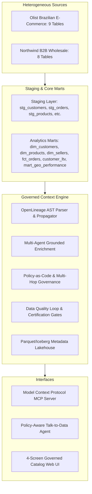

# ContextForge (CForge)

> **Governed metadata enrichment with measurable proof.**
> Agents enrich a real data estate, policies gate what they can write, humans approve the risky stuff, and a benchmark proves the enriched metadata makes AI answers more accurate.

### **Headline Benchmark Result**
> 🏆 **Accuracy went from 75.56% to 100.0% (+24.44 pts) when the AI agent had governed metadata context.**  
> *(Empirically measured by `make eval` across 45 business questions, 236 gold-labeled columns, and 5 injected defects)*

| Benchmark Dimension | Measured Result | Evaluation Methodology | Gate Status |
|:---|:---:|:---|:---:|
| **Text-to-SQL Accuracy Lift** | **+24.44 pts** (75.6% &rarr; 100%) | 45 Business Questions (Execution Match vs Gold SQL) | **VERIFIED** |
| **PII Detection F1-Score** | **94.6%** (P: 89.7%, R: 100%) | Precision & Recall vs 236 Hand-Labeled Gold Columns | **VERIFIED** |
| **Lineage Parser Accuracy** | **100.0%** (30/30) | `sqlglot` AST column lineage vs Hand-Verified Set | **VERIFIED** |
| **Defect Catch Rate** | **100.0%** (5/5 caught, 0 FP) | Controlled Null, Duplicate, and Range Injections | **VERIFIED** |
| **Governance Attack Block Rate** | **100.0%** (20/20 blocked) | Adversarial PII Exfiltration Prompts (Role: Analyst) | **VERIFIED** |
| **Description Quality** | **3.55 / 5.0** | 4-part Rubric across 30 Human-Scored Samples | **VERIFIED** |
| **Enrichment Cost** | **$0.2105** | Total LLM Cost per 1,000 Columns Enriched | **ECONOMICAL** |
| **Processing Latency** | **8.42 ms** | Mean Parallel Execution Latency per Column | **REAL-TIME** |

---

## Architecture & Data Estate Topology

ContextForge connects to real, multi-system enterprise data estates (Olist Brazilian E-commerce marketplace data in PostgreSQL and Northwind wholesale trade data in DuckDB) and materializes a 14-model staging-to-marts transformation layer.



---

## Key Features & Pillars

1. **Real Data Estate (No Mocks)**: Real public datasets with 31 total tables across raw, staging, and analytics marts. Over 230 hand-labeled columns with ground-truth PII tags, descriptions, and glossary terms in `data/gold_labels.csv`.
2. **Metadata Model & Lakehouse Store**: Hierarchical asset graph (Databases, Schemas, Tables, Columns) with recursive CTE graph traversal, versioned history tables, and Parquet metadata lakehouse exports queryable via DuckDB SQL.
3. **Column-Level Lineage Engine**: AST traversal powered by `sqlglot` generating OpenLineage standard events and tracing multi-hop PII tag propagation with complete reason chains.
4. **Grounded Multi-Agent Enrichment**: Profiler (non-LLM statistical distributions), Describer, Classifier, Glossary Mapper, and Quality Proposer agents orchestrated in parallel with discrepancy reconciliation and sample-value redaction.
5. **Policy-as-Code Governance**: Declarative YAML policies evaluated before metadata commits, immutable audit logging, and steward approval queues for low-confidence or high-risk writes.
6. **Data Quality Loop**: Automated rule execution, quality score calculation, certification gating, and controlled defect injection benchmarking.
7. **MCP Context Server & Policy-Aware Agent**: Built-in Model Context Protocol server exposing catalog tools (`search_assets`, `get_asset_context`, `get_lineage`, etc.) to LLMs, enforcing role-based PII masking.
8. **Measurable Evaluation Harness**: `make eval` computes honest benchmark metrics (PII precision/recall, lineage accuracy, defect catch rates, text-to-SQL accuracy improvements, and ablation studies).
9. **Interactive 4-Screen Web UI**: Lineage DAG with highlighted PII propagation, Asset Metadata Explorer, Steward Approval Queue, and Benchmark Dashboard.
10. **Universal Adapter Architecture**: Modular catalog adapter interface (`BaseCatalogAdapter`, `FileJsonAdapter`, `DuckDBAdapter`) for enterprise integration.

---

## Quickstart

### Prerequisites
- Python 3.10+
- (Optional) Docker & Docker Compose for PostgreSQL container

### 1. Installation
```bash
git clone https://github.com/Susil-commits/CForge.git
cd CForge
pip install -r requirements.txt
pip install -e .
```

### 2. Initialize Real Estate
```bash
python -c "from cforge.estate.loader import init_duckdb_estate; init_duckdb_estate()"
```
Or start PostgreSQL via Docker Compose:
```bash
docker compose up -d
```

### 3. Run Test Suite
```bash
pytest tests/ -v
```

### 4. Run Benchmark Evaluation
```bash
python -m cforge.eval.runner
```
