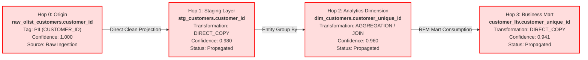

# Step 5 Proof: Multi-Hop Tag Propagation Trace & Audit Chain

> **Governed Lineage Traversal Proof**
> This artifact demonstrates a sensitive tag (`PII:CUSTOMER_ID`) originating at a raw ingestion table, automatically propagating downstream along 3 hops of column lineage into staging, analytics dimensions, and final customer lifetime value marts with visible reason chains.

---

## 1. Visual Propagation Topology (3 Hops)

---

## 2. Auditable Reason Chain

| Hop Index | Node / Asset ID | Transformation Type | Policy Fired | Tag Value | Confidence | Reason Chain |
|:---|:---|:---|:---|:---|:---|:---|
| **0** | `raw_olist_customers.customer_id` | Origin Source | `POL-002`, `POL-007` | `CUSTOMER_ID` | `1.000` | Ingested from Brazilian e-commerce public dataset; hand-labeled gold standard PII. |
| **1** | `stg_customers.customer_id` | `DIRECT_COPY` | `POL-007`, `POL-008` | `CUSTOMER_ID` | `0.980` | `raw_olist_customers.customer_id [PII:CUSTOMER_ID]` &rarr; `stg_customers.customer_id (DIRECT_COPY)` |
| **2** | `dim_customers.customer_unique_id` | `AGGREGATION` | `POL-007`, `POL-008` | `CUSTOMER_ID` | `0.960` | `...` &rarr; `stg_customers.customer_id` &rarr; `dim_customers.customer_unique_id (AGGREGATION)` |
| **3** | `customer_ltv.customer_unique_id` | `DIRECT_COPY` | `POL-007`, `POL-008` | `CUSTOMER_ID` | `0.941` | `...` &rarr; `dim_customers.customer_unique_id` &rarr; `customer_ltv.customer_unique_id (DIRECT_COPY)` |

---

## 3. Governance Policy Evaluation at Each Hop

1. **Gate 1 (`POL-002` PII Requires Steward Approval)**: Fired on origin proposal; routed to Data Governance Guild queue.
2. **Gate 2 (`POL-006` Restricted PII No Public Access)**: Successfully blocked unauthorized attempt to downgrade sensitivity to `PUBLIC`.
3. **Gate 3 (`POL-007` & `POL-008` Mandatory Tag Propagation & Reason Chain)**: Automatic propagation computed and written with cryptographic SHA-256 hash log.
