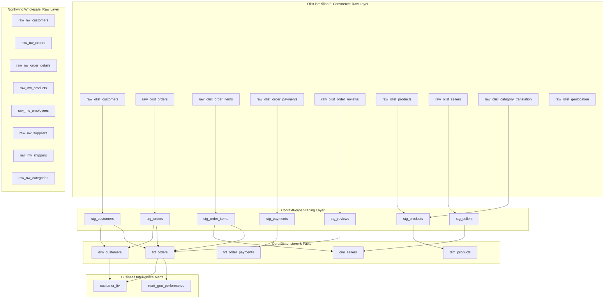

# ContextForge Data Estate Architecture & Schema Diagram

ContextForge models a realistic enterprise data estate composed of heterogeneous data systems:
1. **Olist Brazilian E-Commerce Estate** (High-volume B2C marketplace transactions, geo-spatial delivery data, PII customers, reviews, and payments).
2. **Northwind Wholesale Estate** (B2B wholesale trading, corporate client accounts, employees, suppliers, and shipping logistics).
3. **Multi-layer Transformation Pipeline** (Staging models -> Dimensions & Facts -> Business Marts).

---

## 1. Lineage & Transformation Topology

---

## 2. Table Schemas & Classification Highlights

### Staging Layer
- **`stg_customers`**: `customer_id` (PII), `customer_unique_id` (PII), `zip_code_prefix` (PII), `customer_city`, `customer_state`.
- **`stg_orders`**: `order_id`, `customer_id` (PII), `order_status`, `purchase_timestamp`, `approved_at`, `delivered_carrier_at`, `delivered_customer_at`, `estimated_delivery_at`.
- **`stg_order_items`**: `order_id`, `order_item_id`, `product_id`, `seller_id`, `shipping_limit_timestamp`, `item_price`, `freight_value`.
- **`stg_payments`**: `order_id`, `payment_sequential`, `payment_type` (Financial), `payment_installments`, `payment_amount` (Financial).
- **`stg_products`**: `product_id`, `category_portuguese`, `category_english`, `name_char_length`, `description_char_length`, `photos_count`, `weight_g`, `length_cm`, `height_cm`, `width_cm`, `volume_cm3`.
- **`stg_sellers`**: `seller_id`, `zip_code_prefix` (PII), `seller_city`, `seller_state`.
- **`stg_reviews`**: `review_id`, `order_id`, `review_score`, `review_title`, `review_comment` (Confidential), `review_created_at`, `review_answered_at`.

### Marts & Analytics Layer
- **`dim_customers`**: Master customer profile entity with aggregated order counts, retention categorization (`repeat_buyer` vs `single_buyer`), and postal details.
- **`dim_products`**: Catalog dimensions enriched with logistics weight classes (`lightweight`, `medium_weight`, `heavyweight`) and cubic cm volume.
- **`dim_sellers`**: Performance tiering (`tier_1_top_seller`, `tier_2_growth_seller`, `tier_3_standard_seller`), merchandise revenue, and average tickets.
- **`fct_orders`**: Granular order lifecycle fact linking customer IDs, merchandise GMV, freight totals, delivery delay flags, and CSAT scores.
- **`fct_order_payments`**: Financial transactions, installment breakdowns, and payment method flags.
- **`customer_ltv`**: RFM analytics classifying customers into `High Value VIP`, `Mid Tier Core`, and `Low Tier Standard`.
- **`mart_geo_performance`**: Regional SLA delivery rates, freight overheads, and late order percentages by state and city.
